# Ergodash

> Note: Information as of December 2022

## General notes
* Kailh-like hotswap switch sockets are mandatory for Corne build.
* I wanted a USB Type C connector so I went with Elite-C microcontrollers, you can get any Pro-Micro compatible ones.
* I decided to socket the Elite-Cs and the OLEDs.
* I don't use per-key backlighting, so it's not covered.
* You can save a lot of money by getting cheapers microcontrollers, using normal headers instead of sockets, buying generic components (LEDs, diodes, headers, hardware, etc.) from non-keyboard parts-specific stores or not having the OLEDs.

## Parts list
> Note: Doesn't include keycaps

| Name | Notes | Total Price |
|:----:|:-----:|:-----------:|
| [PCB Set](https://keycapsss.com/keyboard-parts/pcbs/53/crkbd-split-keyboard-pcb-corne-helidox?number=KC10022_MX_WH) | | 14 € |
| [Parts Kit](https://keycapsss.com/keyboard-parts/pcbs/53/crkbd-split-keyboard-pcb-corne-helidox?number=KC10022_PARTS) | Diodes, TRRS connectors, reset buttons and OLED sockets | 8 € |
| 2x [Elite-C](https://splitkb.com/products/elite-c-low-profile-rev4-microcontroller) | | 40 € |
| 2x [Mill-Max Low Profile Sockets](https://splitkb.com/products/mill-max-low-profile-sockets?_pos=1&_sid=3bce89d5a&_ss=r) | | 9 € |
| [Pins](https://keycapsss.com/keyboard-parts/parts/240/needle-connector/pins-10mm-x-0.6mm-pitch-2.54mm?c=11) | You need any pins to fit inside the sockets, THT diode legs should be fine too | 2.4 € |
| [WS2812B LEDs](https://splitkb.com/products/ws2812b-rgb-led?_pos=2&_sid=136a9a0aa&_ss=r) | These ones are for underglow, you only need 12 | ~4.5 € |
| 2x [SSD1306 OLED Display](https://splitkb.com/collections/keyboard-parts/products/oled-display?variant=31716335648845) | You need 128x32 | 13 € |
| [Base Plate Set](https://splitkb.com/collections/cases-and-plates/products/aurora-corne-low-profile-case?variant=43446808674563) | | 18 € |
| [Bottom Plate Set](https://splitkb.com/collections/cases-and-plates/products/aurora-corne-low-profile-case?variant=43446808838403) | | 9 € |
| [OLED Cover Set](https://splitkb.com/collections/cases-and-plates/products/aurora-corne-low-profile-case?variant=43468300189955) | | 4 € |
| [Hardware Kit](https://splitkb.com/collections/cases-and-plates/products/aurora-corne-low-profile-case?variant=43446809035011) | | 9 € |
| [Switch Sockets](https://splitkb.com/products/kailh-hotswap-sockets?variant=43579173961987) | 50x, 42 needed for the build | 8 € |
| [Switches](https://keygem.com/collections/tactile/products/gazzew-u4t-10pcs) | 50x, 42 needed for the build | 33 € |
| **Total** | |        **171.9 €**     |

## Build process

This is the order I was getting the parts, your order may be different, doesn't matter much.

### 1. Soldering diodes

Mind the direction of the diode, indicated by some sort of a line, which should align with the line, marked on the PCB.

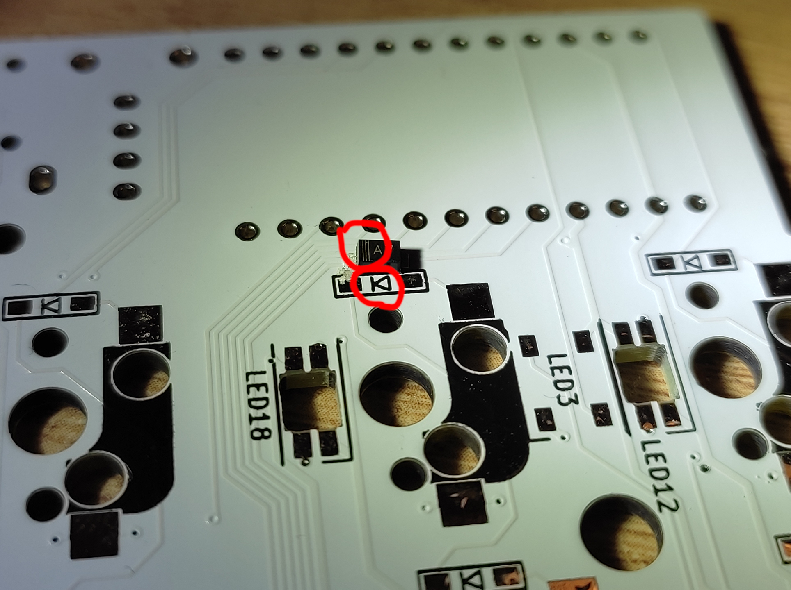

I suggest you put some solder on one pad for each diode and then align it while heating the solder, that way you can align them easier.

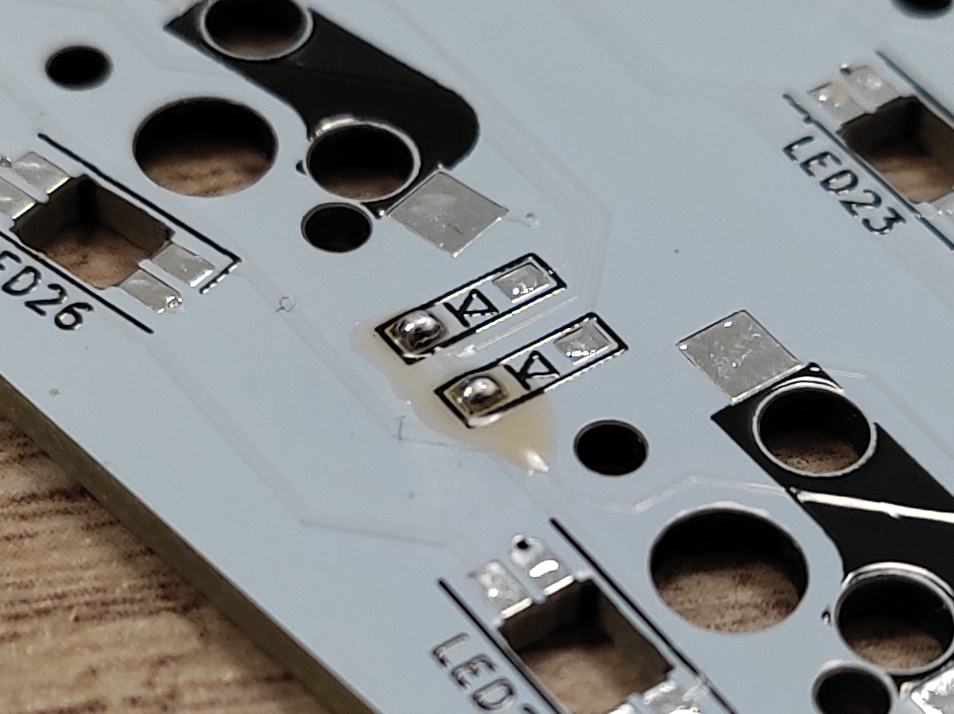

### 2. Soldering underglow LEDs

Pay attention to the orientation, a cut corner on the LED should match marking on the PCB (hopefully your PCB is marked better than mine). Same technique works here - put some solder on one pad, fix the LED in place, solder the rest of the pads.

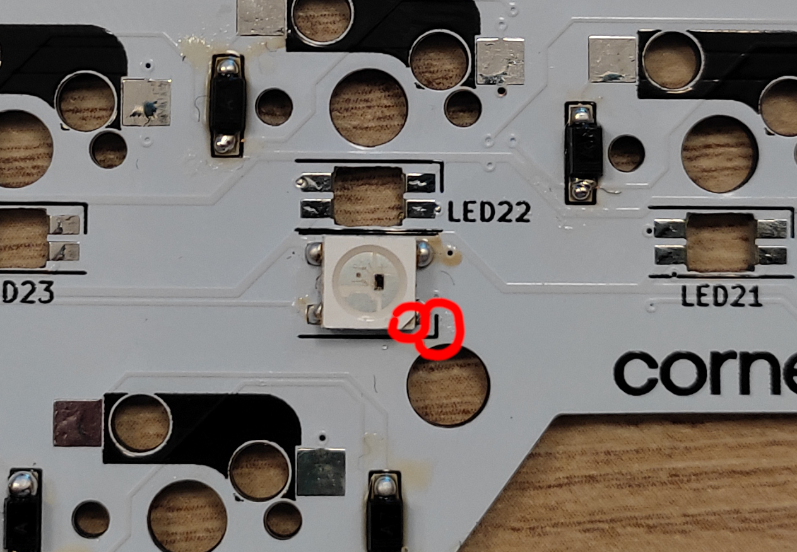

### 3. Soldering the TRRS connectors and the reset button

### 4. Soldering the microcontroller sockets

Make sure the sockets are facing the upper side of the board. You wouldn't want to desolder these.

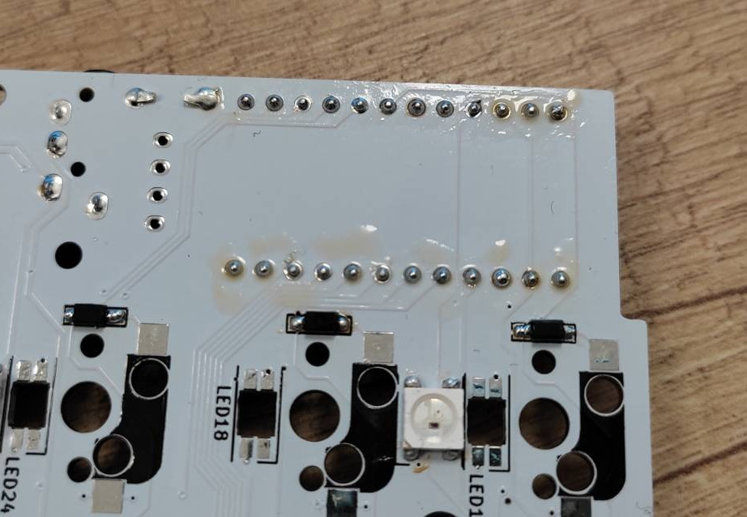

### 5. Flashing the microcontroller

Make sure you set a correct bootloader in the `rules.mk` (for Elite-C you need to set `BOOTLOADER = atmel-dfu`).

### 6. Soldering the microcontroller pins

Put four corner pins to position the microcontroller in place and then solder in one side before continuing to the other. Make sure the pins are inserted all the way into the sockets. Also make sure all the pins are well soldered in place, otherwise you will have random connection issues that can be tricky to debug.

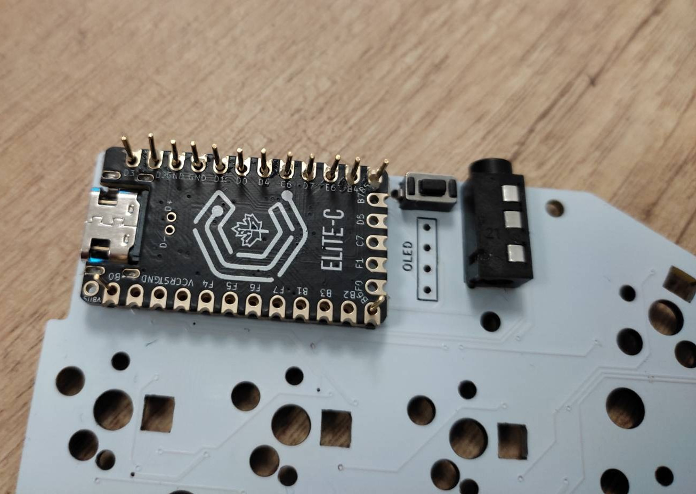

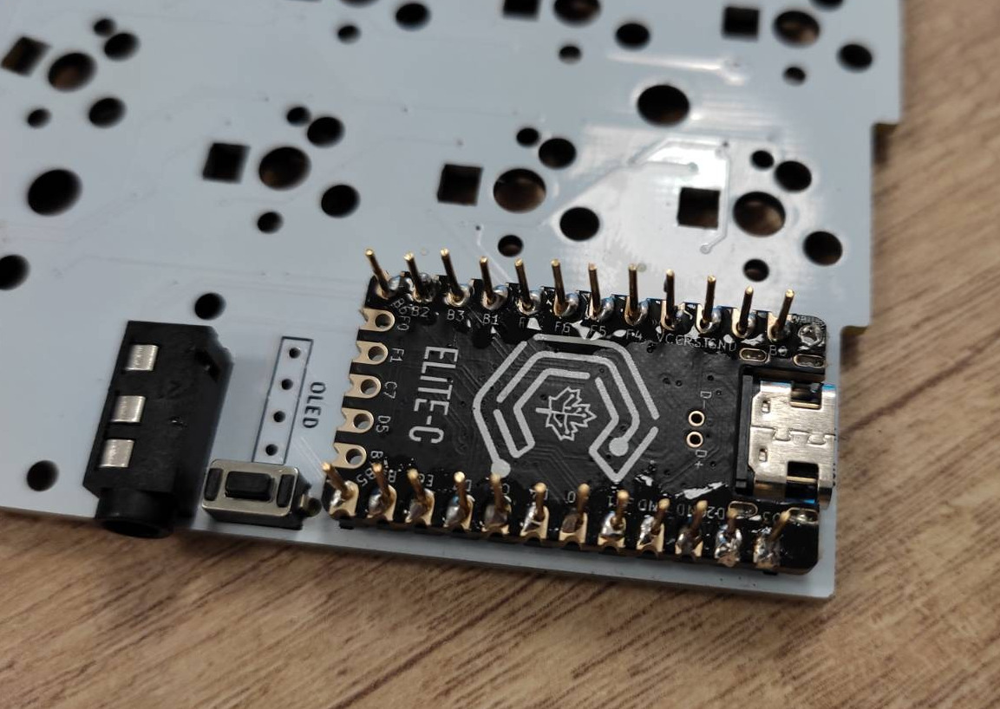

### 7. Testing

Attach the cable and the underglow LEDs should all light up. After that shorting the key contacts should produce a keystroke signal.

### 8. Attaching the switch sockets

The same technique as when attaching diods and LEDs works well here.

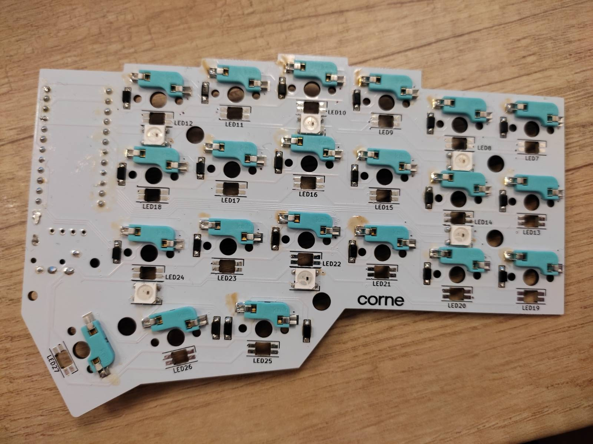

### 9. Soldering the OLED sockets

Common OLED sockets are suitable for square pins so you shouldn't need to desolder the pins from the OLED unless you want to use Mill Max sockets.

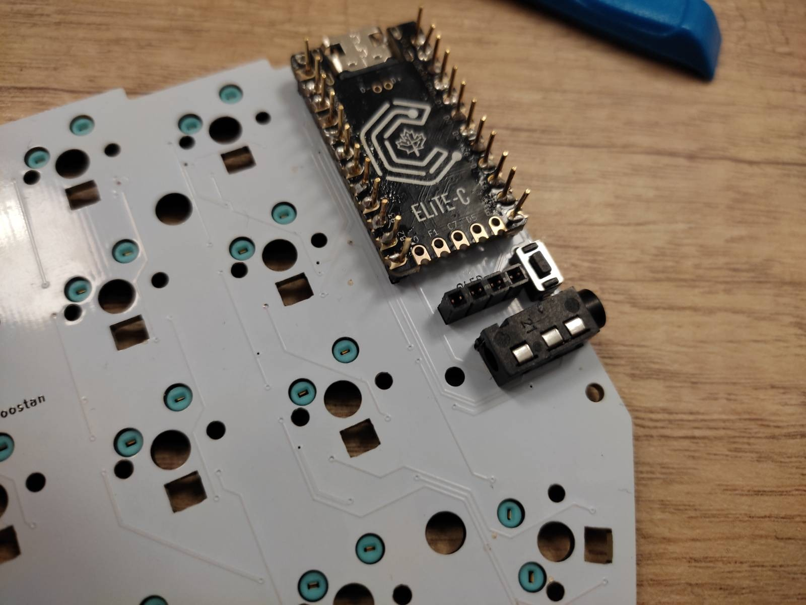

### 10. Testing with the switches and the OLED

While putting in the OLED you might want to trim the pins or remove the plastic pin housing. Put in a couple of switches just to make sure everything works so far.

### 11. Cleaning up the PCB

You can use all sorts of stuff to remove the flux residue from the PCB, but nail polish remover on a q-tip worked fine for me.

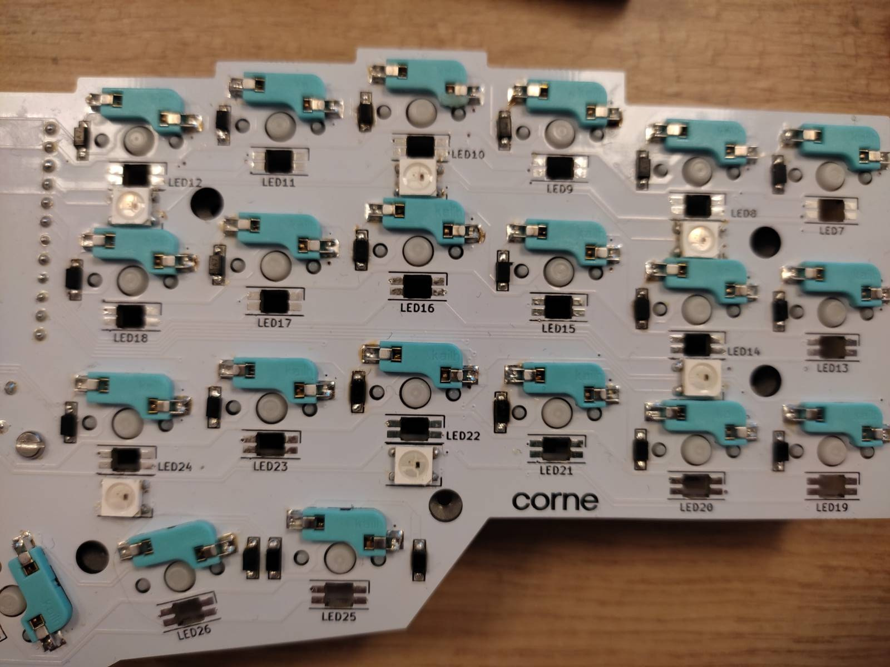

### 11. Assembling the case and enjoyng the outcome

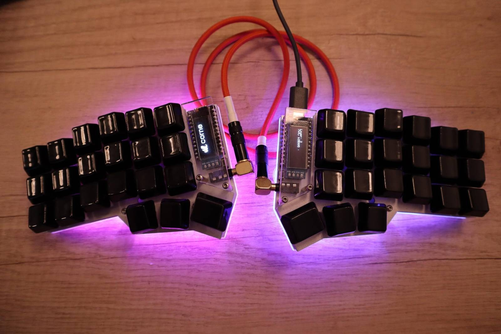
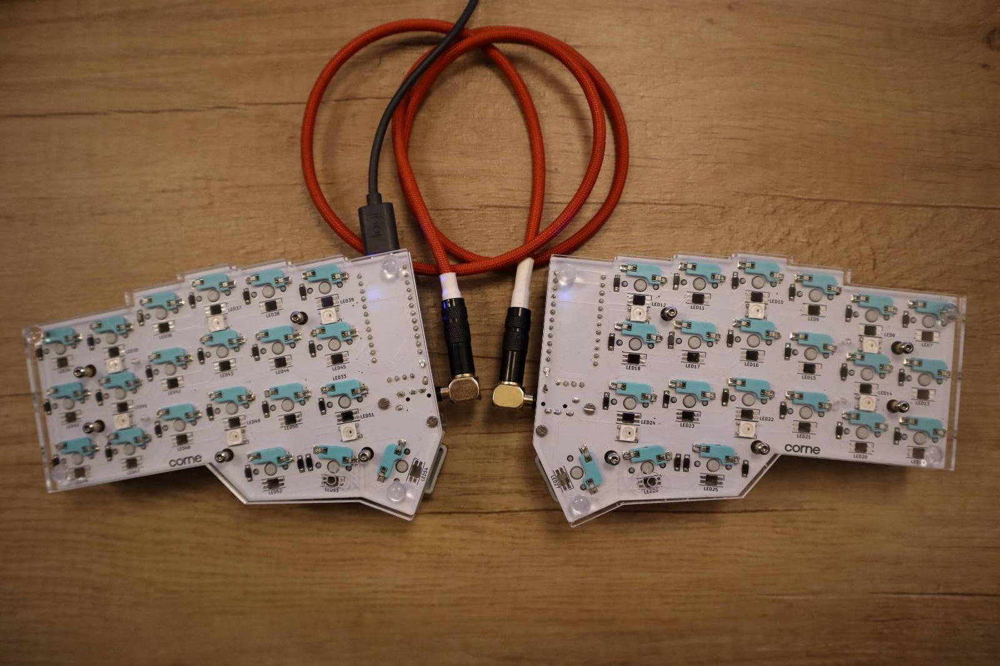
